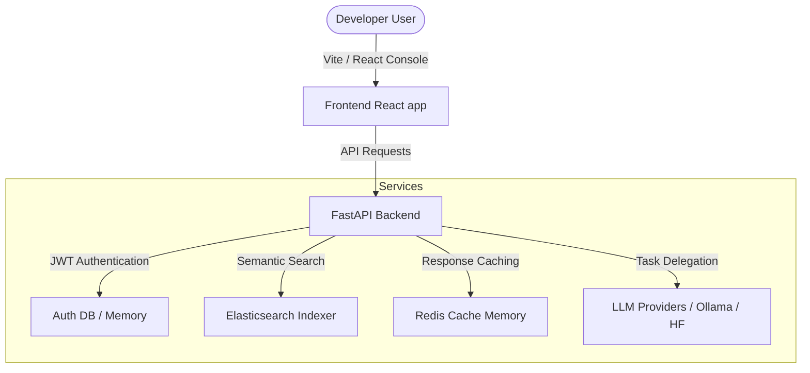
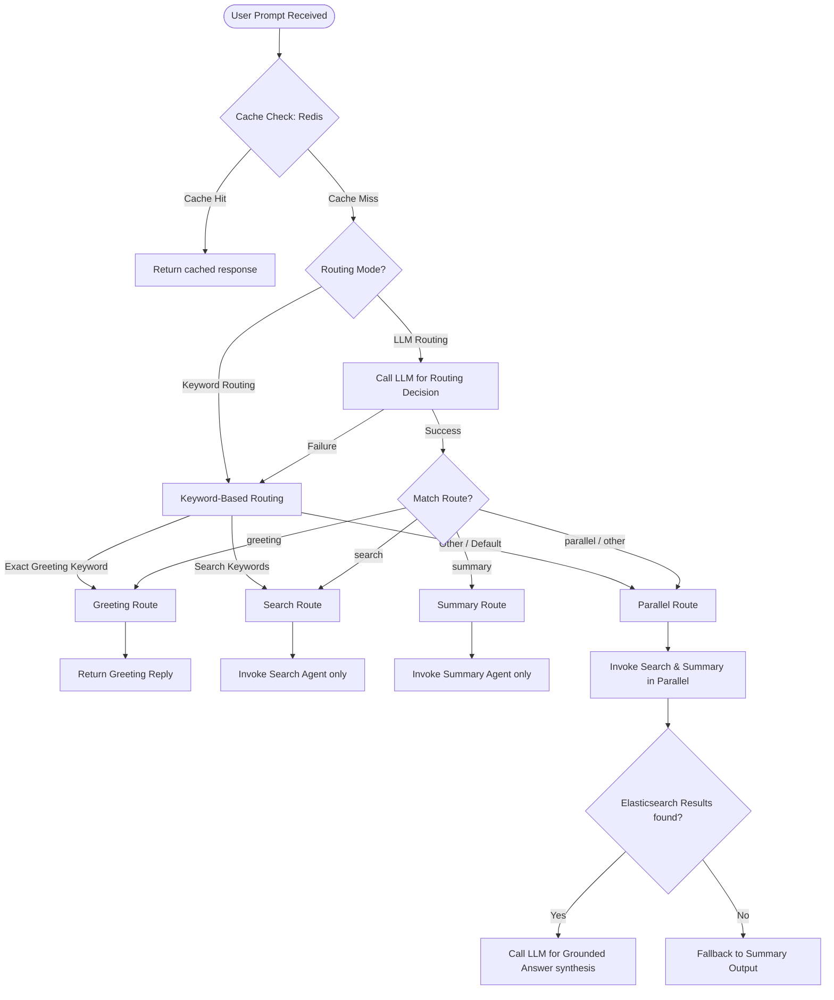

# Multi-Model Agent Orchestration Platform

A high-performance, developer-focused workspace designed to deploy, test, and observe autonomous AI agent routing workflows. The platform dynamically routes tasks between optimal model nodes, retrieves factual catalog context using Elasticsearch, and caches duplicate queries with Redis for sub-second response times.

---

## Architecture & Technology Stack

The platform is divided into two primary services orchestrated alongside caching and database nodes:



### Supervisor Routing Workflow

The Supervisor Agent dynamically routes incoming user prompts to the correct processing nodes. The decision workflow operates as follows:



### 1. Frontend Console
* **Core**: Vite + React 19 + TypeScript.
* **Routing**: React Router v7 (clean sub-path routing).
* **Styling**: Tailwind CSS v4 + customized HSL slate-obsidian dark tokens.
* **Key Visuals**: Responsive resizable developer columns, interactive CSS pipeline layout, live diagnostics summary, and trace stdout trackers.

### 2. FastAPI Backend
* Exposes high-performance asynchronous API routers using FastAPI (Uvicorn).
* Handles CSV and batch catalog files parsing into semantic vector stores.
* Implements token session checking and JWT encryption.

### 3. Caching & Database Layers
* **Redis**: Acts as an in-memory cache. Identical agent tasks bypass the LLMs entirely and resolve immediately.
* **Elasticsearch**: Vector store containing indexed tooling catalogs (like `ai_tooling_catalog.csv`) to feed relevant context constraints into LLM prompts.

---

## Getting Started

Follow these instructions to run the entire system locally:

### Prerequisites
* **Node.js** (v18+ or v20+)
* **Python** (v3.10+ / `uv` package manager recommended)
* **Docker & Docker Compose** (to orchestrate Redis & Elasticsearch)

---

### Step 1: Start Database Services
The project includes a `docker-compose.yml` to launch Redis and Elasticsearch:
```bash
docker compose up -d
```
Verify that Redis is listening on port `6379` and Elasticsearch is running on port `9200`.

---

### Step 2: Configure & Launch Backend
1. Navigate to the `backend` directory:
   ```bash
   cd backend
   ```
2. Create and customize your local `.env` configuration:
   ```bash
   cp .env.example .env
   ```
3. Sync dependencies and boot up the FastAPI application:
   ```bash
   uv run uvicorn app.main:app --reload --port 8000
   ```
   *The backend documentation will be accessible at `http://127.0.0.1:8000/docs`.*

---

### Step 3: Launch Frontend Console
1. Navigate to the `frontend` directory:
   ```bash
   cd ../frontend
   ```
2. Install dependencies:
   ```bash
   npm install
   ```
3. Launch the development server:
   ```bash
   npm run dev
   ```
   *The client console will be accessible at `http://localhost:5173`.*

---

## API Reference & Routes

| Endpoint | Method | Authentication | Description |
| :--- | :--- | :--- | :--- |
| `/health` | `GET` | None | Runs connectivity checks for Redis, Elasticsearch, and prints running LLM providers. |
| `/api/v1/auth/register` | `POST` | None | Creates a new developer account. |
| `/api/v1/auth/login` | `POST` | None | Verifies credentials and returns a JWT Bearer access token. |
| `/api/v1/ingest/batch` | `POST` | JWT Bearer | Indexes catalog data files from target folders into Elasticsearch. |
| `/api/v1/chat` | `POST` | JWT Bearer | Processes queries, decides routing paths, retrieves search context, checks cache, and delegates calls to LLMs. |
| `/api/v1/conversations/{id}/context` | `DELETE` | JWT Bearer | Deletes chat session memory logs from Redis storage. |

---

## Developer Tools & Workspace

When logged into the dashboard, developers can observe real-time execution pipelines:
* **Session Monitor**: Inspect active JWT tokens and conversation IDs.
* **Diagnostics Card**: Check if a query was resolved via a Redis Cache `HIT` or `MISS`.
* **Trace Stdout Panel**: View isolated logs showing intermediate task evaluations of sub-agents (e.g. `SEARCH`, `SUMMARY`, `ANSWER`).
* **Activity Logger**: Stream server alerts, query timestamps, and errors into a scrollable terminal container.
